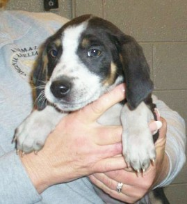
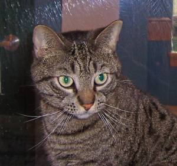

# 🐕 Are You A Dog?

This project is aim to build a project to determine whether an 
input image contain a dog or not. The system is implemented using Pytorch 
and demo by streamlit.

This project is just a practice for me to know more about DL
## Dataset

Training dataset for this project comes from the following datasets:
- [Cats and Dogs Classification Dataset](https://www.kaggle.com/datasets/bhavikjikadara/dog-and-cat-classification-dataset)
- [Selfies](https://www.kaggle.com/datasets/jigrubhatt/selfieimagedetectiondataset)
- [Random images](https://www.kaggle.com/datasets/shamsaddin97/image-captioning-dataset-random-images?resource=download)

My dataset: [dataset](https://www.kaggle.com/datasets/hominhdang/are-you-dog/data)

Data preprocess is simple: resized and normalized.

## Model
The model for this project is 2D CNN, implemented with Pytorch:
- 3 convolutional layers + ReLU + maxpool
- 3 fully connected layers with Dropout
- Softmax output for classification

Loss function: CrossEntropyLoss, optimizer Adam, epoch 10

Model achieve 82.81% acc, 82.72% precision, 82.81% recall, 82.76% f1-score.

## Streamlit app
The project includes a Streamlit web app that allows users to:
- Upload an image
- View prediction and confidence score

## How to Run

### Install dependencies
pip install -r requirements.txt

### Training
python src/train.py

### Run Streamlit app
streamlit run app/streamlit_app.py

## Sample result
| Image | Prediction | Confidence |
|------|-----------|------------|
|  Dog | Dog | 97% |
|  Cat | Not Dog | 99% |

## Limitations
- Limited dataset size
- Binary classification only
- Performance may degrade on unseen domains
